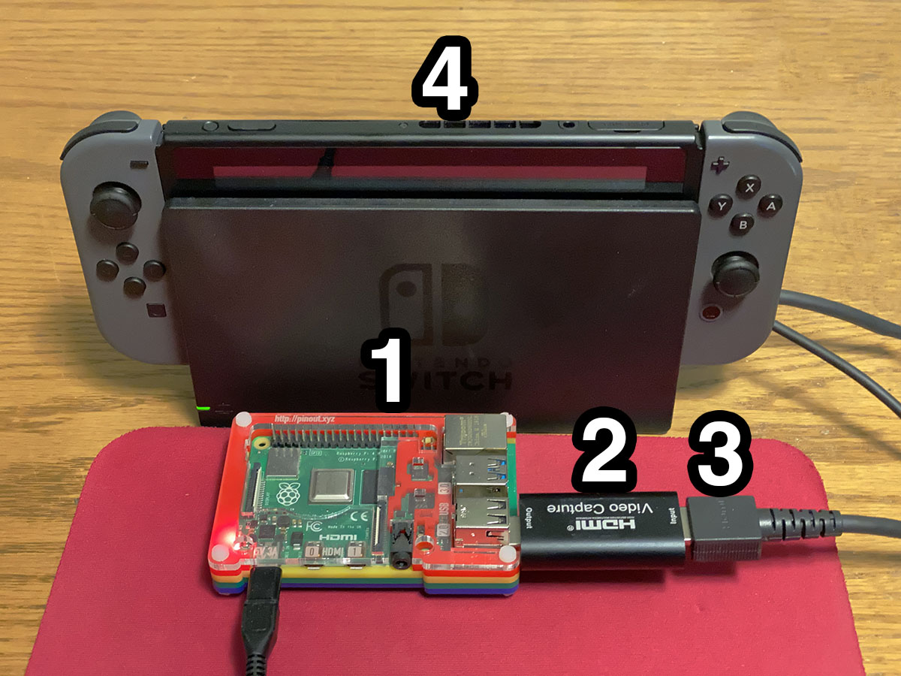

# BDSP Automation

<div align="center">
  
</div>

This repository aims to automate the repetitive or difficult aspects of Pokemon Brilliant Diamond and Shining Pearl. Automation is accomplished through analysis of Switch video output and controls issue through an emulated Pro Controller.

Functionality is split into two main components:
1. An automation script specific to a given task that performs video analysis and controls the Switch.
2. A webpage/server for viewing video from the Switch and displaying stats from a given automation script.

## Requirements

### Hardware Requirements

- A computer running Linux (or a virtual machine running Linux).
    - Wifi/Bluetooth functionality and at least one USB port are necessary.
- A *docked* Nintendo Switch with an HDMI output cable and a copy of Brilliant Diamond or Shining Pearl.
    - The Switch Lite **is not** compatible with these scripts due to it not including video output.
- An HDMI-to-USB "Video Capture" device.
    - Any HDMI-to-USB device that exposes input video as a webcam will work. For the budget conscious, almost all generic "HDMI to USB Video Capture Cards" off of Amazon, Ebay, etc are capable and should cost no more than $15-20. Those aiming for a higher quality (but more expensive) device can take a look at Elgato's Cam Link. For this project, either device (generic brand or Elgato) should work equally well.

<div align="center">
  
</div>

An example setup is pictured in the above image. The numbered items correspond to the following:

1. A Raspberry Pi 4B (4GB of RAM) with Wifi and Bluetooth capabilities
2. An HDMI-to-USB Video Capture device
3. The Switch's HDMI cable which connects the capture device and the Switch dock.
4. A docked Nintendo Switch running a game

### Software Requirements

- Python 3.6+
- Pip
- A few Python packages
- tmux
- v4l2loopback

## Initial Setup

1. Ensure that Python 3 is available on your command line. The following command should generate output similar to the following:

```bash
> python3 --version
Python 3.7.3
```

If `python3` is not available, please use the package manager on your system to install it.

2. Check that Pip is available to install Python packages:

```bash
> pip3 --version
pip 18.1 from /usr/lib/python3/dist-packages/pip (python 3.7)
```

If `pip3` is not available on your system, please use your package manager to install `python3-pip`.

3. Use `pip3` to install the required Python packages

```bash
pip3 install -r requirements.txt
```

4. Install tmux through your system's package manager

```bash
#Example for APT package manager-based systems
sudo apt-get install tmux
```

5. Install v4l2loopback through your system's package manager

```bash
#Example for APT package manager-based systems
sudo apt-get install v4l2loopback-dkms
```

6. Configure your Switch with the following settings
    - The Dark Theme should be selected as your system theme.
    - The Switch's dock output resolution should be set to 480p. This helps with transcoding and streaming on low-end hardware. This setting is located in System Settings > TV Settings > TV Resolution
    - (Optional) If the script you plan to run does not require internet access and likely will run for a prolonged period of time, you should disconnect your Switch from the internet. This prevents updates prompts, which can derail automation.
