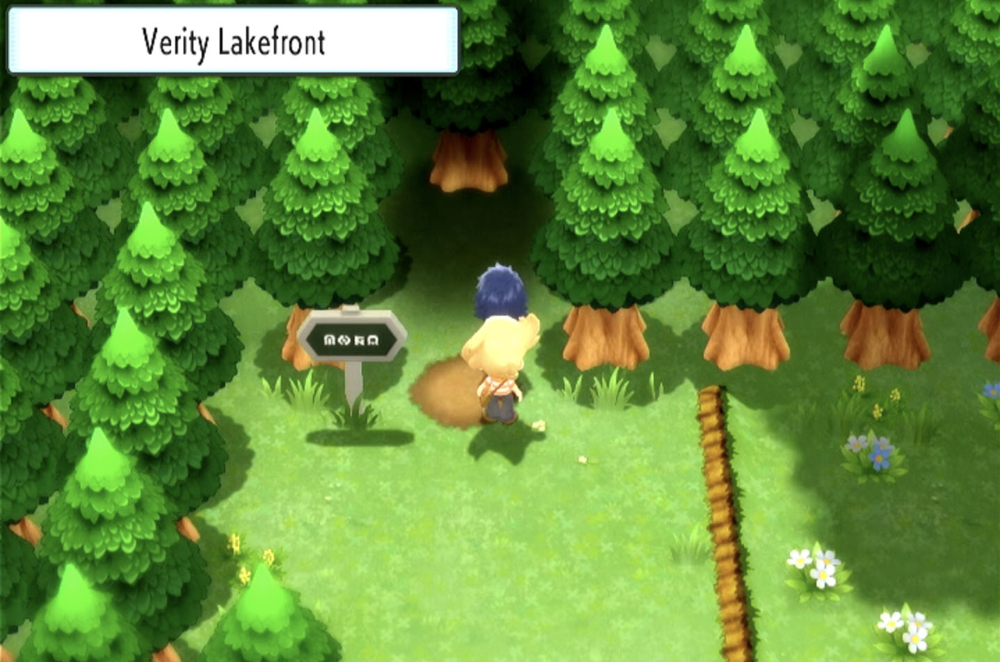

# Resetting for a Shiny Starter

Before following the rest of this guide, please ensure you have completed the initial setup steps detailed on the main README for this repository.

## Setup

1. Start with a fresh save and continue playing until your character is tasked with walking to the Lakefront with your rival. Position your character such that they are on the verge of entering the Lakefront. This can be done by tapping the D-pad and saving after each movement. Proper positioning should look something like the image below:

<div align="center">
  
</div>

2. Once in position, quit the game and remain on the Switch homescreen with Brilliant Diamond or Shining Pearl selected.

3. Disconnect all controllers from the Switch.

4. Dock the Switch (if not docked already) and connect the video output to your computer through your capture device of choice.

5. Run the `broadcast.sh` bash script (located at the root of this repository) with the following command:

```bash
# The following command will start a tmux session.
# If you want to re-use your current terminal window, you can quit tmux (and have the server continue running) with Ctrl + b
./broadcast.sh
```

6. Run the `shiny_starter.py` script located at the root of this repository.

```bash
sudo python3 shiny_starter.py
```